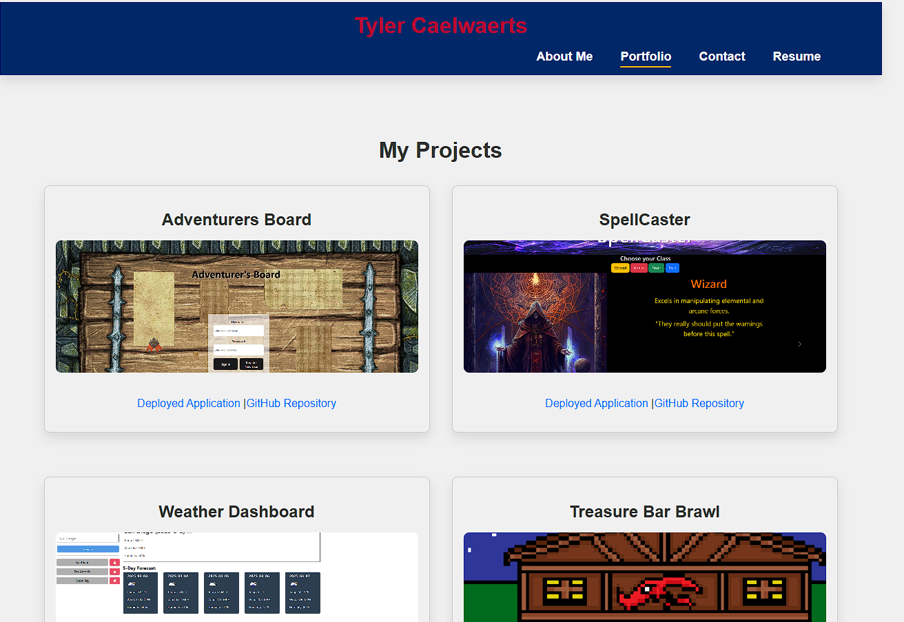

# Professional Portfolio

This is a professional portfolio to showcase my software development skills.

## Website

Check out the website of my portfolio [here](https://tylercportfolio.netlify.app/).

## Description

This site shows my portfolio with my previous and current projects, as well as my skills and contact information.

## Usage

With the opening page on the About Me, navigate in the top right to the different sections. Each Project has a repo and a deployed page for them, and the resume has a link to download my current resume. The button for the contact currently does not work, so I included my email at the top.
